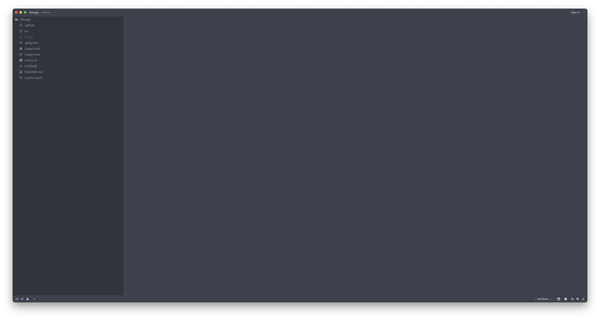
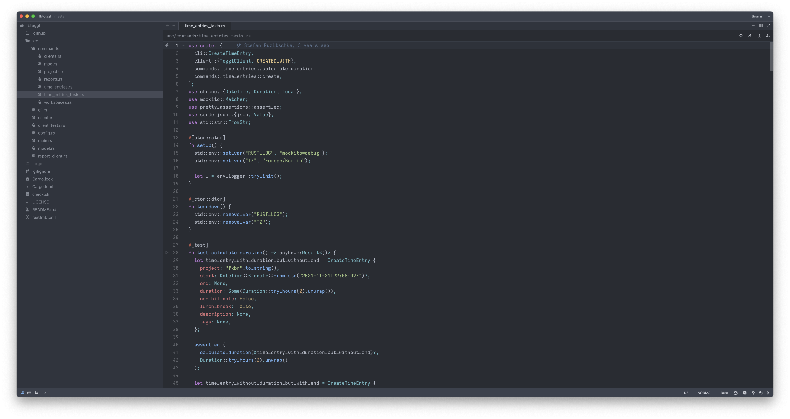
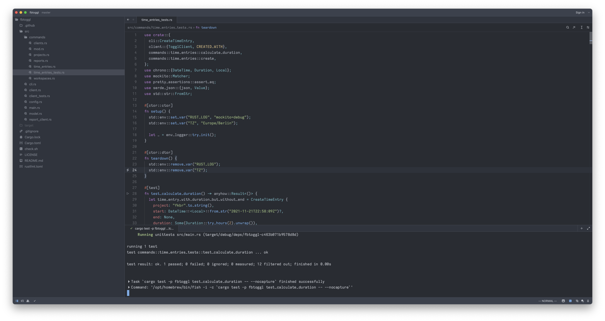
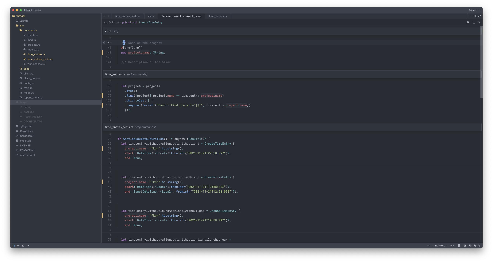

A common habit of developers is searching for new tools on a regular basis. Visual Studio Code is such a tool which helped me over the years write some awesome code. But I always wanted to try something new. So I stumbled upon Zed.

## So what is Zed?

Zed is a fairly new code editor written in Rust by the awesome folks which created tools like [Atom](https://github.com/atom/atom). It got open sourced in the beginning of 2024. Zed aims to be a fast, collaborative and hackable editor. But have a look for yourself [here](https://github.com/zed-industries/zed).

I personally really like that it comes with a lot of [extensions](https://github.com/zed-industries/zed/tree/main/extensions) and ["vim mode"](https://zed.dev/docs/vim).

## Installation

You could build Zed either from source or download a pre-compiled binary (only macOS is currently supported).

I personally used `brew` to install Zed: `brew install zed`

## Let's open a project

The first thing you see is an empty window. I typically use `⌘ + P` to open the file finder and navigate to my file of choice.

Here you see the file finder in action.

## Working with Rust

Zed is "language aware" and detected that I opened a Rust file and applies the correct syntax highlighting. The [Rust extension](https://zed.dev/docs/languages/rust) is shipped with Zed by default.
The extension uses [rust-analyzer](https://github.com/rust-lang/rust-analyzer) for things like code completion, running tests and [tree-sitter-rust](https://github.com/tree-sitter/tree-sitter-rust) for syntax highlighting.
It also added indicators for Rust tests, so that I can run them directly from the editor. Let's try it out :)

After clicking the "Run" button (the little "play" icon next to the test function), the test output is displayed in the built-in terminal at the bottom of the window.

Let's do some refactoring. I open the `editor: rename` option (via Command Palette) by pressing `⌘ + Shift + P`, change the name of the variable and see all changes in some kind of preview window.

## Conclusion

Coming from Visual Studio Code, knowing its key bindings and what not, the transition to Zed was quite a smooth ride. I used it for 2 weeks to write some Rust and TypeScript and did not miss too much. I will definitely stick with Visual Studio Code for now, because some extensions e.g. [zed-sql](https://github.com/evrensen467/zed-sql) is still behind what the Visual Studio Code ecosystem offers.

Things I haven't yet tried are the AI integration and the collaboration features, but I will definitely give them a try in the future.

I'm very happy with the overall experience so far and I'm looking forward to a bright future for Zed.
